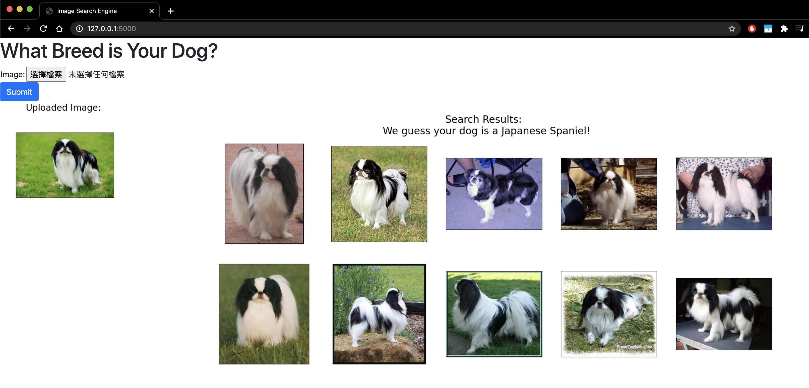

# Reverse Image Search Engine
### Overview
This project focuses on developing a reverse image search engine using ResNet-152, Milvus, and Flask. The system leverages deep learning and vector similarity to identify images that closely match a given input image.


### Objectives
* Build a scalable and efficient reverse image search engine.
* Explore the integration of deep learning models with vector databases for real-world applications.
* Provide a web-based interface for intuitive user interaction.

### Workflow:
1. Model Training:
      * Fine-tune a pre-trained ResNet-152 model using PyTorch, with trainable parameters limited to 2 layers.
      * Encode the Stanford Dogs Dataset into vector representations using the trained model.

2. Vector Indexing:
   Utilize Milvus to create a collection and store the image vectors.

3. Image Querying:
   * Encode the input image into a vector representation using the ResNet-152 model.
   * Perform a similarity search with the cosine similarity algorithm in Milvus to identify the closest matching vectors.

4. Results Display:
   * Return and display the most similar images from the Stanford Dogs Dataset through a user-friendly web interface built with Flask.

### Technologies and Frameworks
- **ResNet-152**: Deep learning model for image feature extraction
- **Milvus**: Vector database for indexing and similarity search
- **Flask**: Web framework for backend development
- **PyTorch**: Framework for model training and fine-tuning

### Data Source
1. Input data for the ResNet-152 model (Download the file from the below link, unzip it and put it in the **deep_learning/input/model** folder):
   https://www.kaggle.com/code/halfendt/dog-breed-classifier-pytorch-resnet-152/output
2. Images for displaying (Download the file from the below link and unzip it. Then follow the path: archive/images, there is the **Images** folder. Select all files in the **Images** folder and put them in the **deep_learning/input/stanford-dogs-dataset** folder):
   https://www.kaggle.com/datasets/jessicali9530/stanford-dogs-dataset/data


### Features
1. **Accurate Image Retrieval**: Uses cosine similarity for efficient vector matching.
2. **Scalable Architecture**: Supports large-scale image datasets with Milvus.
3. **User-Friendly Interface**: Built with Flask to provide seamless querying and result display.

### How to Build and Run
1. Install Dependencies:
   ```bash
   pip install -r requirements.txt  
   ```

2. Set Up Milvus:
Install and start Milvus following the official Milvus documentation.
Create a collection to store image vectors.

3. Prepare Data:
Download and organize data as described in the Data Source section.

4. Run the Application:
   ```bash
   python app.py 
   ``` 
4. Open the Application:
Access the web interface at http://localhost:5000.

### Results
1. Efficient Search Engine: Perform fast and accurate reverse image searches.
2. Scalable Storage: Milvus enables handling of large image datasets.
3. Interactive Interface: Retrieve and display results with a visually appealing interface.

### Future Work
1. Expand the dataset to include more categories for broader use cases.
2. Improve the user interface with advanced frontend frameworks like React.
3. Optimize the search process for faster response times.


Note: When an input image comes in, our application first uses the resulting ResNet-152 model to translate the image into a vector. Since all the vectors in the collection are normalized, the query vector is then used by the cosine similarity algorithm to find the most related vectors in the collection through Milvus. The returned vectors then correspond of the images in the Stanford Dogs Dataset, and the images are returned as the most related results.